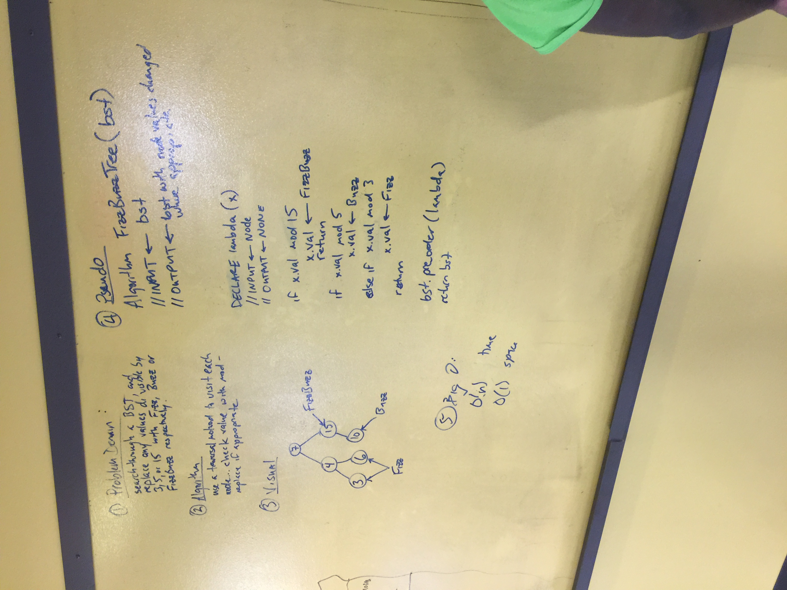

# Binary Search Tree(BST)

This directory is where I'm going to be working on Binary Search Tree related whiteboard challenges, stay tuned as it becomes updated throughout the week.

# FizzBuzz Tree

## Challenge
Write a function called FizzBuzzTree which takes a tree as an argument.
Without utilizing any of the built-in methods available to your language, determine weather or not the value of each node is divisible by 3, 5 or both, and change the value of each of the nodes respectively. Return the tree with it’s news values.

## Solution
​