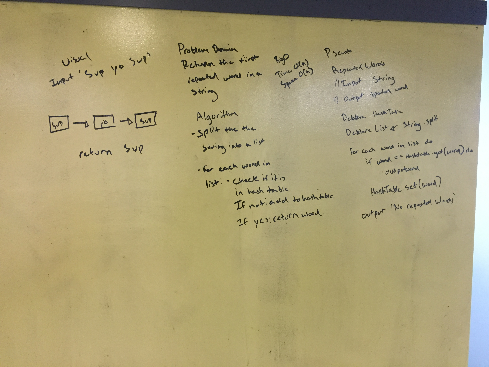
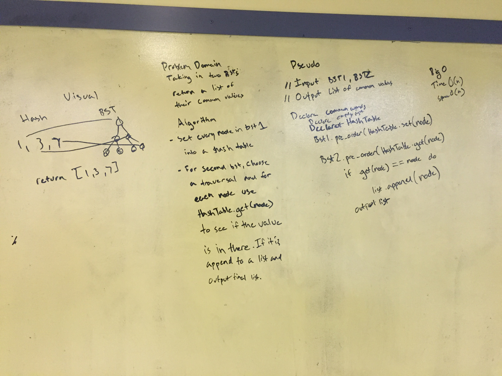

# Hash Tables
In this directory I will be working on the Hash Table data structure and completing various challenges stay tuned for updates.

# First repeated word

## Challenge
Write a function that accepts a lengthy string parameter.
Without utilizing any of the built-in library methods available to your language, return the first word to occur more than once in that provided string.

## Solution

# Intersection of binary trees

## Challenge
Write a function called tree_intersection that takes two binary tree parameters.
Without utilizing any of the built-in library methods available to your language, return a set of values found in both trees.

## Solution
