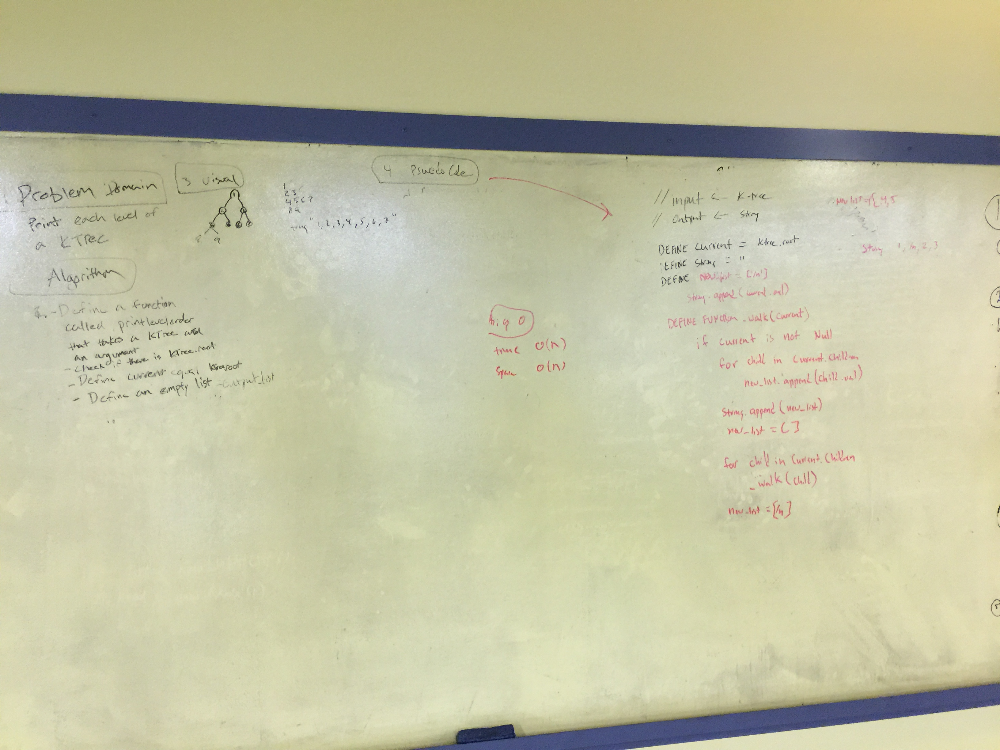
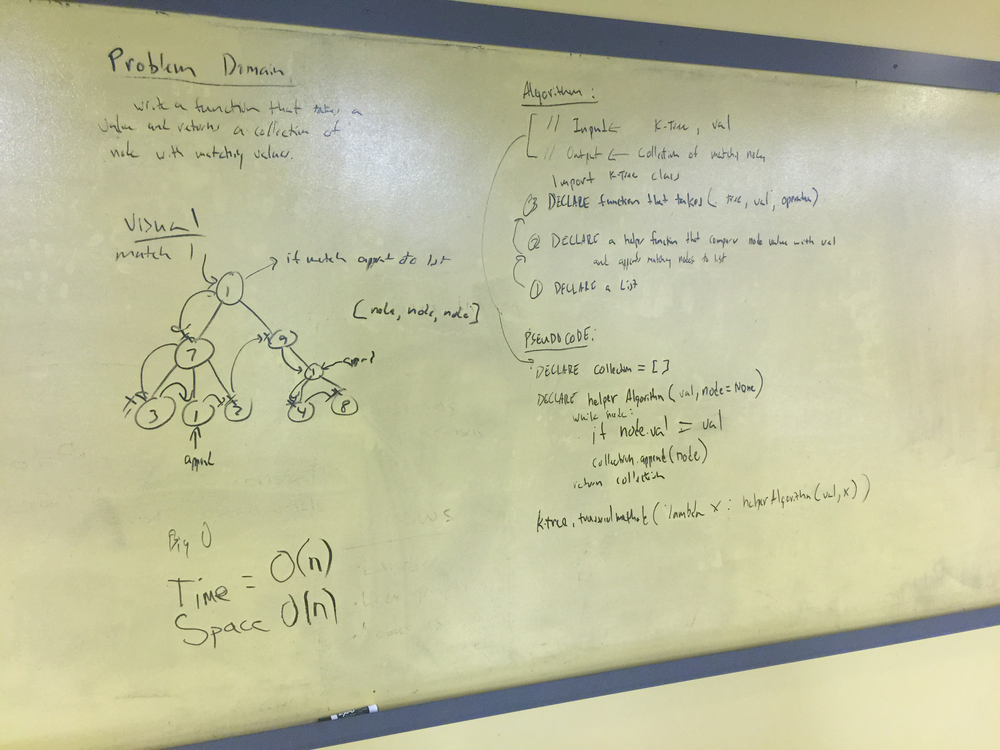

# K-ary Trees
- In this directory I will be documenting my K-ary tree based challenges throughout the week. Stay tuned for updates.

## Level-order printout of a K-ary Tree

### Challenge
Write a function based on the specifications above, which takes in a k-ary tree. Without utilizing any of the built-in methods available to your language, return a string that contains a listing of all values in the tree, with new lines in-between each level of the tree.

#### Solution

## Find all matches

### Challenge
- Write a function that takes a k-ary tree with non-unique values and a target value.
- Return a collection of all the nodes from within the tree that match the provided value.
- Avoid utilizing any of the built-in methods available to your language.

#### Solution

